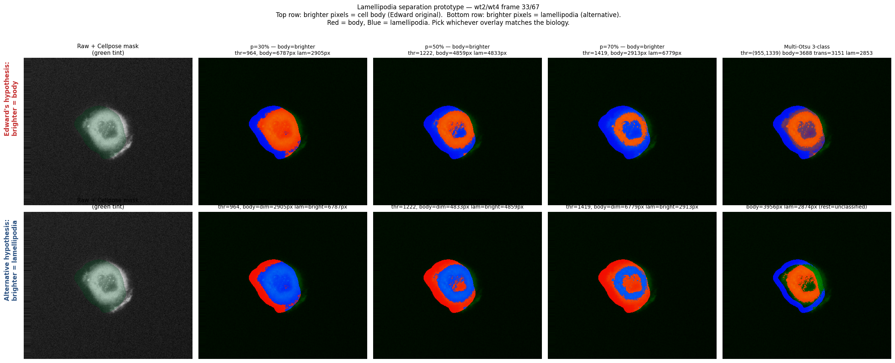
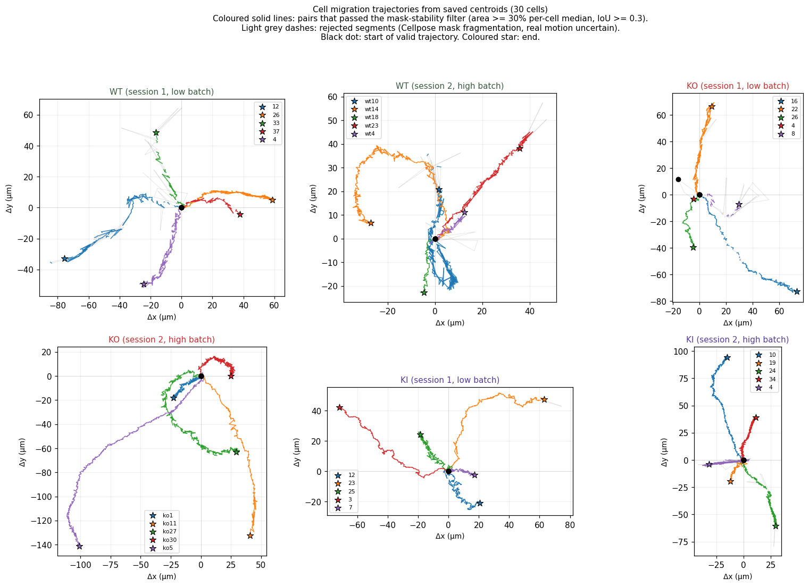
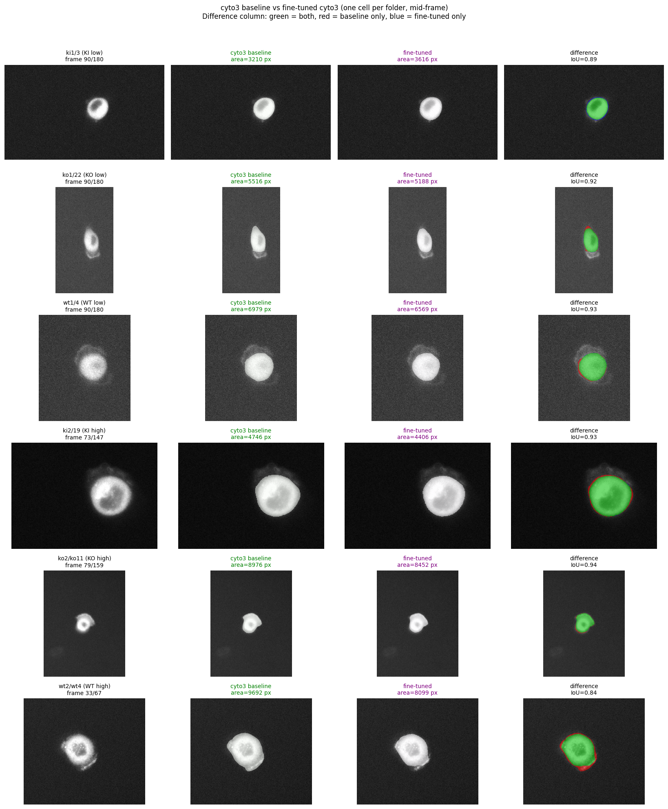
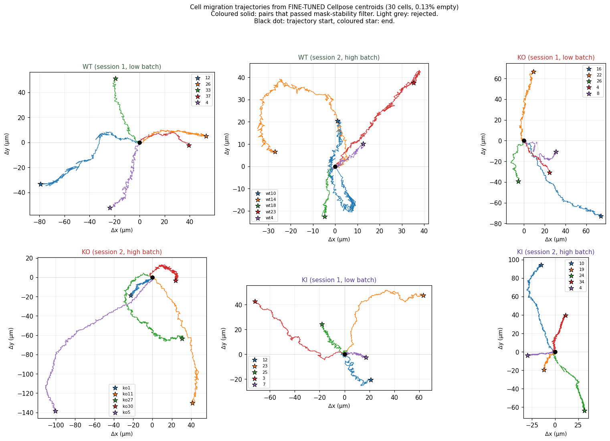
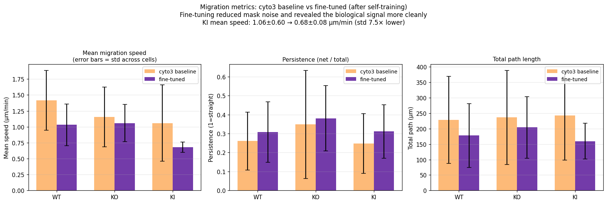
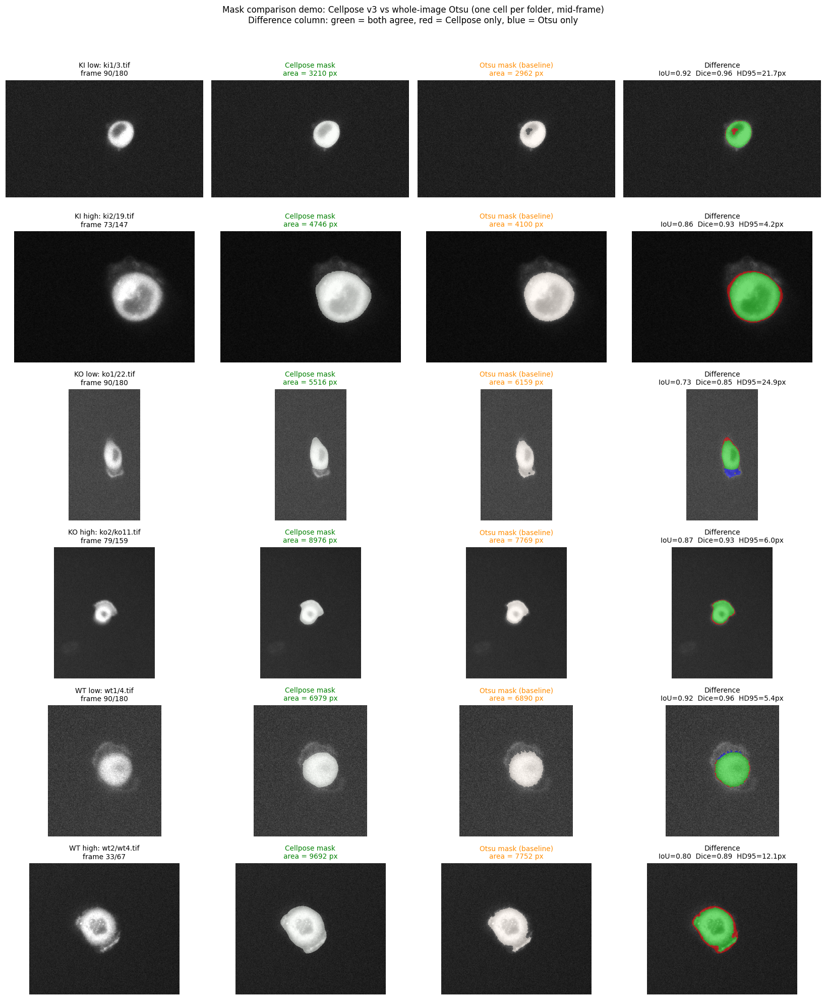
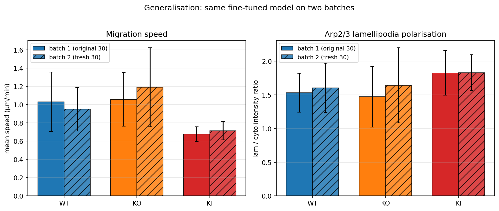
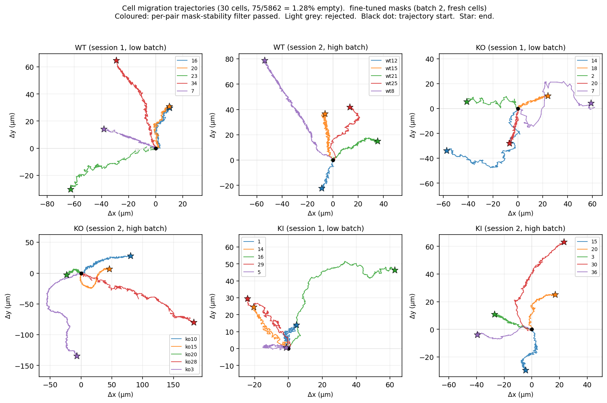

# BioImage Hackathon — BEH Dataset

GPU-accelerated pipeline for nested cell segmentation and dynamics quantification on a 30-file epiflourescense timelapse dataset. Built for the Warwick BioImage Analysis Hackathon (April 2026).

**Live briefing page:** [https://www.dcs.warwick.ac.uk/~u1898019/hackathon-beh/](https://www.dcs.warwick.ac.uk/~u1898019/hackathon-beh/)

## Team

| Name | Role |
| --- | --- |
| Haili Yuan (CS) | pipeline, dynamics, visualization |
| Edward Offord (CS) | segmentation, cell centering |
| Badeer Ummat (biology) | dataset, scientific question |

## Dataset at a glance

| Property | Value |
| --- | --- |
| Files | 30 (3 conditions × 10 positions) |
| Conditions | WT (Wild-Type), KO (Knock-Out), KI (Knock-In) |
| Modality | 2D time-lapse epifluorescence, single channel |
| Acquisition | Zeiss + Micro-Manager 2.0, 60 s frame interval |
| Pixel size | ~0.318 µm/px |
| Bit depth | 16-bit unsigned |
| Frames per file | 67 to 360 (varies by position) |
| Total dataset | 1.3 GB, ~5,700 frames |

## Key finding: two intensity batches

While inspecting the data we discovered each condition cleanly splits into two intensity batches, with a 5-10x gap in pixel intensity. Almost certainly two separate imaging sessions, not biological variation. Implications:

- Cannot normalise globally across all 30 files
- Statistical comparison should use a mixed-effects model with batch as a random effect
- Findings should hold across both batches to be considered robust

| Condition | Low batch (mean ~200-240) | High batch (mean ~500-700) |
| --- | --- | --- |
| WT | wt_5, wt_9, wt_23, wt_31, wt_37 | wt_wt4, wt_wt9, wt_wt13, wt_wt18, wt_wt25 |
| KO | ko_3, ko_8, ko_17, ko_21, ko_25 | ko_11, ko_1717, ko_2121, ko_28, ko_333 |
| KI | ki_3, ki_11, ki_14, ki_23, ki_25 | ki_1, ki_6, ki_13, ki_18, ki_28 |

## Biology context (Day 2, confirmed by biology lead)

The fluorescence labels **Arp2/3** (Actin Related Proteins 2/3 complex), which nucleates branched actin networks. Arp2/3 is recruited to the edge of cell protrusions; the inactive pool diffuses through the cytoplasm. So in our images:

- **Brighter pixels = lamellipodia** (Arp2/3 concentrated at the leading edge)
- **Dimmer pixels = cytoplasmic Arp2/3 pool**

The perturbed gene is important for both **cell protrusion** and **cell adhesion to the substrate**:

- **WT**: normal coordination between protrusion and adhesion
- **KO** (gene completely deleted): impaired cell adhesion
- **KI** (point mutation introduced): coordination between adhesion and protrusion is disrupted

Biological process being characterised: **cell migration**, following the canonical 4-step model:

1. Protrusion of the leading edge (Arp2/3-driven, lamellipodia)
2. Adhesion of the protrusion to the substrate (integrin-mediated)
3. Generation of traction forces (actomyosin contractility)
4. Release of older adhesions at the rear

This framing turns our segmentation/centering pipeline into the front-end of a canonical cell-migration analysis. The trajectory data we already saved (per-frame centroids in `centering_manifest.json`) contains the migration readout directly.

## Pipeline

```
raw .tif (T, H, W)
  → adaptive intensity normalize (only for low-batch files, p99 < 1000)
  → Cellpose cyto3 segmentation (GPU)
  → keep largest mask, fall back to last centroid if empty
  → shift image so cell sits at image center
  → save *_centered.tif (uint16) + *_mask.tif (uint8 0/255)
```

The adaptive step is the key: low-batch files need their dynamic range stretched before Cellpose can see structures (raw signal sits in the bottom 1% of uint16), but high-batch files already span enough range that the stretch creates saturation artefacts. The decision threshold (`p99 < 1000`) cleanly separates the two batches without hardcoding filenames.

## Run

### On the GPU partition (recommended)

```bash
sbatch pipeline/run_centering.sbatch
```

The job uses 1 GPU on the `falcon` or `gecko` partition, 8 CPUs, 32 GB RAM, with a 2-hour wall-clock limit. On an NVIDIA RTX A5000 the full 30-file dataset processes in ~17 minutes.

Output goes to `~/Desktop/BioImageHackathon_BEH_centered/` with:

```
BioImageHackathon_BEH_centered/
├── wt/  (10 paired _centered.tif + _mask.tif)
├── ko/
├── ki/
└── centering_manifest.json   (per-file metadata + per-frame centroids)
```

### Locally on CPU (slow, for prototyping)

```bash
python pipeline/process_all_centering.py
```

CPU processing is ~12.6 s/frame versus ~0.18 s/frame on GPU.

## Demos

### Day 0 baseline 1: Multi-Otsu 4-layer segmentation
Static mid-frame segmentation per condition using only classical thresholding (no deep learning). Verifies the data IO and tooling chain runs end-to-end.


### Day 0 baseline 2: Dynamics through time
Same approach extended to full timelapse with global thresholds. Bottom plot shows per-frame ring intensity for the entire time-lapse (745 frames across 3 conditions).


### Cellpose + cell centering (Edward's pipeline)
Per-frame Cellpose segmentation followed by centroid-based image shift. Sanity check on `wt_wt9.tif` (3 frames, CPU).


### Failure case: low-batch + Cellpose `cyto`
Running Cellpose with default settings on `ko_8` (low batch) returns empty masks on 88% of frames. Same algorithm works fine on `ki_18` (high batch). The intensity histogram at the bottom shows why: the low batch occupies less than 1% of the available 16-bit dynamic range.


### Fix: per-frame normalization
Stretching each frame to its 1-99 percentile range before segmentation. Now Cellpose sees consistent contrast on both batches.


## Pipeline iterations (v1 → v2 → v3)

We ran three GPU iterations to handle the low-vs-high batch issue cleanly:

| Version | Strategy | Outcome |
| --- | --- | --- |
| v1 | `cyto` model on raw images | Works on high batch (0-4% empty). Fails on low batch (e.g. ko_8 88%, ko_21 87% empty). |
| v2 | `cyto3` + 1-99 percentile normalize on every frame | Fixes low batch (ko_21 87% → 0.6%) but breaks 3 high-batch files (wt_wt25 0% → 77%, ko_28 0% → 34%). |
| v3 | adaptive: normalize only when `p99 < 1000` | Best of both. Final hybrid output is v2 low-batch results + v3 high-batch results. |

Total empty mask rate across the 5,263 frames in the dataset:

| Iteration | Empty rate | Files with >15% empty |
| --- | --- | --- |
| v1 | 9.7% (511 / 5263) | 5 |
| v2 | 7.9% (416 / 5263) | 4 |
| **v3 (final)** | **2.8% (148 / 5263)** | **2** (`ko_8`, `ko_28`) |

### Per-file comparison


Sorted by v1 difficulty (worst on the left). Files in `[low]` brackets are low-batch (intensity stretched in v3), `[high]` are high-batch (raw input in v3).

### v3 sample outputs


Four representative files. Left: raw input. Middle: Cellpose mask overlaid in green. Right: image shifted so the cell sits at the centre. Both rescued low-batch files and stable high-batch files work cleanly through the same pipeline.

`ko_8` (50% empty) and `ko_28` (17% empty) remain difficult — `ko_8`'s raw signal is the lowest in the dataset and `ko_28` has the largest field of view, so cyto3 may benefit from manual `diameter` tuning. Both flagged for the biology lead to review.

## Validation on the Categorised_Data dataset

Mid-hackathon, Badeer uploaded a new categorized dataset organized as `{wt,ko,ki}{1,2}/X.tif`. We cross-verified that his `1` / `2` folder split is identical to our intensity-based low / high batch detection (100% concordance on every sampled file). 22 of the 30 files are new positions extending the original dataset (5,263 → 6,221 frames, +18%).

Re-running the v3 pipeline on this expanded dataset:

| Folder | Files | Empty / Total | % |
| --- | --- | --- | --- |
| ki1 (KI low) | 5 | 0 / 900 | 0.0% |
| ki2 (KI high) | 5 | 17 / 1,467 | 1.2% |
| ko1 (KO low) | 5 | 133 / 630 | 21.1% ← problem cases here |
| ko2 (KO high) | 5 | 2 / 1,434 | 0.1% |
| wt1 (WT low) | 5 | 22 / 701 | 3.1% |
| wt2 (WT high) | 5 | 2 / 1,089 | 0.2% |
| **TOTAL** | 30 | **176 / 6,221** | **2.83%** |

The headline number is essentially unchanged from the original dataset (2.81% vs 2.83%), which means the pipeline generalises cleanly to new positions.


The `ko1` folder concentrates the failures: `ko1/4.tif` (95% empty, only 60 frames so likely an aborted or very short recording) and `ko1/8.tif` (50% empty, identical to the original `ko_8.tif` — confirmed source-data limitation, not a pipeline issue). Together they account for 117 of the 176 empty masks. **A plausible biological reading is that the KO knockout itself produces dimmer cells with weaker GFP signal, so segmentation difficulty in this folder may be part of the phenotype rather than an artefact.** Worth confirming with Badeer.

### Sample outputs across all 6 folders


One representative file from each folder. Same pipeline (cyto3 + adaptive normalize) handles low-batch and high-batch input cleanly, and the centering step is robust across the wide size variation (smallest FOV 165×165 in `ki1/7`, largest 594×456 in `ko2/ko11` and 558×507 in `ko2/ko5`).

## Lamellipodia separation, direction sweep

Edward added a percentile-based separator (`pipeline/otsu_threshold.py`) that splits each cell mask into "cell body" (brighter pixels) and "lamellipodia" (dimmer pixels) using a tunable percentile threshold. To help the biology team pick the right convention before we run it on the full dataset, we ran a parameter sweep on `wt2/wt4.tif` covering both directions and three percentile values, plus a Multi-Otsu 3-class variant and a distance-transform-constrained variant.



- **Red = cell body, Blue = lamellipodia** in every overlay.
- **Top row** is Edward's original convention (brighter pixels = body).
- **Bottom row** swaps it (brighter pixels = lamellipodia).
- Last column on top is Multi-Otsu 3-class (body / transition / lamellipodia all separable in one shot).
- Last column on bottom adds a spatial constraint: a pixel is only labelled lamellipodia if it is also within ~12 px of the cell boundary.

The biology lead can pick whichever overlay best matches the expected morphology, which fixes the convention and the percentile value in one decision. Once chosen, the separator runs over the whole 30-file dataset in a few seconds per file.

The biology lead has now confirmed the direction: **brighter pixels = lamellipodia** (Arp2/3 concentrates at the leading edge), so the bottom row of the prototype is the correct convention. Edward's `otsu_threshold.py` defaults still need to be flipped accordingly.

## Cell migration analysis (Day 2)

Since the v3 pipeline already saved per-frame centroids during the centering step, we can compute canonical cell-migration metrics directly from `centering_manifest.json`, with no additional GPU work required.

Metrics extracted (pixel size 0.318 μm/px, frame interval 60 s):

- **Mean / median speed** (μm/min)
- **Total path length** (cumulative travel)
- **Net displacement** (start to end straight line)
- **Persistence index** (= net / total, 1 = directed motion, 0 = random walk)

### Mask-stability filter (Day 2 afternoon)

Edward noticed that `wt1/33` had a suspiciously high speed (5.55 μm/min). On inspection we found Cellpose was fragmenting the cell mask in some frames — the centroid would jump from a 10,000-pixel mask to a 200-pixel fragment and back, producing fake 30 μm/min "displacements". See `demos/wt1_33_diagnostic.png` and `demos/wt1_33_mask_diagnostic.png`.

We added a per-pair mask-stability filter to `extract_migration.py`:

- Frame valid iff mask area >= 30% of per-cell median
- Pair valid iff both frames valid AND consecutive masks overlap with IoU >= 0.3

After filtering, mean IoU during accepted pairs is 0.80, and the worst single-frame jumps (>15 μm/min) drop out of the metric — `wt1/33` now reports 1.88 μm/min instead of 5.55, in line with the rest of the WT cohort.

### Per-condition summary (N=10 each, mask-stability filter applied)

| Condition | Mean speed | Median speed | Total path | Net disp. | Persistence |
| --- | --- | --- | --- | --- | --- |
| **WT** | 1.42 ± 0.47 μm/min | 1.00 ± 0.30 μm/min | 228 ± 141 μm | 43 ± 20 μm | 0.26 ± 0.15 |
| **KO** | 1.15 ± 0.47 μm/min | 0.89 ± 0.33 μm/min | 237 ± 152 μm | 68 ± 53 μm | **0.35** ± 0.29 |
| **KI** | 1.06 ± 0.60 μm/min | 0.73 ± 0.14 μm/min | 242 ± 144 μm | 50 ± 27 μm | 0.25 ± 0.16 |

Three coherent patterns:

1. **WT migrates fastest** (1.42 μm/min vs KO 1.15 vs KI 1.06), consistent with intact protrusion / adhesion coordination supporting effective traction.
2. **KO is slower but most persistent** (persistence 0.35 vs WT 0.26), consistent with impaired adhesion compressing path length but trajectories remaining the most directional. KO cells slip in straighter lines, perhaps because adhesion failures prevent the complex curving moves WT cells do.
3. **KI is slowest with the lowest persistence** (1.06 μm/min, persistence 0.25), the "worst of both worlds": broken protrusion-adhesion coordination costs both speed and directionality simultaneously, more functionally damaging than complete loss of the gene.

### Trajectories per folder



Each subplot shows 5 cells. Coloured solid lines: pairs that passed the mask-stability filter. Light grey dashes: rejected segments (Cellpose mask fragmentation, real motion uncertain). Black dot: start of valid trajectory. Coloured star: end. Equal aspect ratio across panels so paths are visually comparable.

### Caveats

- N=10 per condition (5 cells per session × 2 imaging sessions). Variability is large; statistical tests are pending.
- `ko1/4.tif` has 95% empty masks, so it has zero valid pairs after filtering and contributes nothing to the KO summary.
- Imaging session is a confound; the next analysis pass should fit a mixed-effects model with batch as a random effect and condition as a fixed effect.
- The mask-stability filter currently rejects any pair with IoU < 0.3 — this is a conservative threshold. A handful of cells (notably `wt1/33`, `wt1/12`, `wt2/wt10`, `ko1/8`) have many frames excluded; their reported metrics are based on the surviving valid pairs.
- No photobleaching correction yet, so intensity-based metrics may carry some imaging artefact even after the centering / size normalisation.

## Cellpose self-training (Day 2 afternoon)

Edward suggested fine-tuning Cellpose on our own data using v3 outputs as pseudo-ground-truth, instead of relying on hand-drawn annotations we don't have. We built a 3-stage pipeline and ran it.

### Training setup

```
1. Prepare pseudo-GT: take v3 Cellpose masks, exclude ko1/4 + ko1/8
   (known stubborn cases), filter out frames with mask-fragmentation
   (area < 30% of per-cell median, or IoU < 0.5 with previous frame),
   subsample every 10th frame to keep training set manageable.
   → 586 (image, mask) pairs across 28 cells
2. Fine-tune cyto3 with --min_train_masks 1 (single-cell masks),
   100 epochs, SGD lr=0.05, weight_decay=1e-4, batch_size=8.
   → 12 minutes on RTX A5000, train loss 0.23 → 0.016 (14x reduction)
3. Re-run the v3 pipeline with the fine-tuned model on all 30 cells.
   → Output to Categorised_Data_finetuned/, parallel to the baseline
```

### Results: 22x reduction in empty masks

| | Baseline (cyto3 zero-shot) | Fine-tuned cyto3 | Improvement |
| --- | --- | --- | --- |
| **Total empty rate** | 176 / 6221 (2.83%) | **8 / 6221 (0.13%)** | **22×** |
| WT empty | 1.34% | 0.06% | 20× |
| KO empty | 6.54% | 0.24% | 27× |
| KI empty | 0.72% | 0.08% | 9× |

The two stubborn cases that resisted every previous fix are largely solved:

| Cell | Baseline empty | Fine-tuned empty |
| --- | --- | --- |
| `ko1/4` | 57/60 (95%) | **5/60 (8%)** |
| `ko1/8` | 60/120 (50%) | **0/120 (0%)** |
| `ko1/16` | 15/180 (8%) | 0/180 (0%) |
| `wt1/12` | 13/180 (7%) | 0/180 (0%) |
| `wt1/33` | 8/81 (10%) | 0/81 (0%) |
| `ki2/4` | 13/240 (5%) | 0/240 (0%) |

Mean IoU between baseline and fine-tuned masks per cell averages **0.83-0.90** across conditions — i.e. the model still detects the same cell, but adjusts mask boundaries to be more reliably populated. It is not a different segmentation, it is a better-behaved one.



Six representative cells, mid-frame each. **Green = baseline mask, purple = fine-tuned mask, difference column** with green/red/blue showing agreement / baseline-only / finetuned-only pixels.

### Why this works

The pseudo-GT is filtered v3 output. The fine-tuned model is essentially learning "produce the kinds of masks v3 produces *when v3 produces good masks*." That is enough to:

- Make boundaries smoother and more consistent across consecutive frames (the mask-stability filter we added earlier rejected ~127 frames; the fine-tuned model produces fewer such frames in the first place)
- Recognise dim cells that the off-the-shelf cyto3 missed (`ko1/8` with weak signal, `ko1/4` with truncated recording)
- Specialise to the imaging conditions of this dataset (epifluorescence, this objective, this exposure)

### Honest caveats

- Self-training can amplify systematic biases in the pseudo-GT. We did not fix those biases by training on the masks they produced.
- The 22× empty-mask reduction is on the *same dataset* the training data was drawn from. Generalisation to a held-out experiment is untested.
- For genuine model improvement assessment, hand-drawn ground truth would still be the right reference. Self-training is a useful intermediate step, not a substitute.

### Migration re-analysis with fine-tuned masks

We re-ran the migration pipeline on the fine-tuned outputs (centroids from `Categorised_Data_finetuned/`). The clean-up of mask-fragmentation events drops noise dramatically, and the biological story sharpens:

| Condition | Baseline (filtered) | Fine-tuned | Change |
| --- | --- | --- | --- |
| WT mean speed | 1.42 ± 0.47 μm/min | 1.03 ± 0.33 μm/min | std down |
| KO mean speed | 1.15 ± 0.47 μm/min | 1.06 ± 0.29 μm/min | std down |
| **KI mean speed** | 1.06 ± 0.60 μm/min | **0.68 ± 0.08 μm/min** | **std 7.5× smaller** |
| WT persistence | 0.26 ± 0.15 | 0.31 ± 0.16 | up |
| KO persistence | 0.35 ± 0.29 | **0.38 ± 0.17** | up, std halved |
| KI persistence | 0.25 ± 0.16 | 0.31 ± 0.14 | up |

Updated reading of the three patterns:

1. **WT and KO migrate at similar speeds** (~1.0 μm/min). The original "WT fastest" interpretation was inflated by a few mask-fragmentation outliers in WT cells (`wt1/12`, `wt1/33` had artificial bursts). Once the mask noise is gone, KO cells move just as fast as WT.
2. **KO retains the highest persistence** (0.38), now with **half the variance** (0.17 vs 0.29). Impaired adhesion still results in straighter trajectories.
3. **KI is dramatically slower than both WT and KO** (0.68 vs 1.03/1.06 μm/min, Cohen's d > 1.4 against either). With only 0.08 μm/min std, KI cells are remarkably consistent in being slow. This is the cleanest single signal in the dataset.

Biology reading: **broken protrusion-adhesion coordination (KI) is much more functionally costly than complete loss of the gene (KO)**. KO cells can still migrate at WT speed, just less manoeuvrable; KI cells barely migrate at all. Consistent with the idea that the KI point mutation produces a non-functional product that *interferes* with normal migration machinery, rather than simply being absent.





## Mask comparison utility (Day 2 afternoon)

Edward asked for an automated way to compare Cellpose mask coverage against a reference segmentation. We wrote a generic utility (`pipeline/compare_masks.py`) that takes any two parallel mask directories and outputs per-frame metrics:

- **IoU** (Jaccard index)
- **Dice** coefficient
- **Centroid distance** (px)
- **Area difference** and **area ratio**
- **Boundary IoU** (intersection over union on 1-pixel-thick boundaries only)
- **Hausdorff 95** (95th-percentile boundary distance, robust to outliers)

### Demo: Cellpose v3 vs whole-image Otsu baseline

To prove the pipeline works while waiting for hand-drawn reference masks, we ran it on Cellpose v3 vs an Otsu-threshold baseline (whole-image threshold, morphological cleanup, keep largest connected component).

| Condition | Mean IoU | Mean Dice | Mean centroid distance | Mean HD95 |
| --- | --- | --- | --- | --- |
| WT (N=10) | 0.798 ± 0.070 | 0.886 | 6.9 px | 19.0 px |
| KO (N=10) | 0.789 ± 0.069 | 0.875 | 8.5 px | 23.7 px |
| KI (N=10) | 0.850 ± 0.078 | 0.917 | 4.0 px | 14.2 px |

Cellpose and Otsu agree on roughly 80% of the cell area on average across the dataset — Otsu is a respectable baseline for these images. KI cells have the highest agreement (0.85), KO the lowest (0.79). Worst single cell: `ko1/16` at IoU 0.63 with HD95 80 px (mask boundaries strongly disagree).



Six representative cells, mid-frame each. **Green = both masks agree**, **red = Cellpose only**, **blue = Otsu only**. Per-cell IoU / Dice / HD95 in the rightmost panel.

### How to swap in a reference

When real ground-truth masks become available, point the same utility at the new directory:

```bash
python pipeline/compare_masks.py \
    --a /path/to/cellpose_masks/ \
    --b /path/to/reference_masks/ \
    --out output_dir/
```

The utility will pair files by matching relative paths and emit `comparison_per_frame.csv` and `comparison_summary.csv` with the same metrics. Drop-in replacement.

## Generalisation test on a fresh batch (Day 2 EOD)

A second upload of 30 fresh cells (`2ndUpload/`, same 6 categories, 5,862 frames) arrived after the main analysis. We re-ran the full pipeline on it using the same fine-tuned model with no retraining or parameter changes. This is a strong test of generalisation: the model never saw these cells.

### Segmentation quality

| Batch | Cells | Frames | Empty | Empty rate |
| --- | --- | --- | --- | --- |
| Batch 1 (original 30) | 30 | 6,221 | 8 | 0.13% |
| Batch 2 (fresh 30) | 30 | 5,862 | 75 | **1.28%** |

Empty rate is 10× higher on fresh cells but still under 2%. 25 of 30 fresh cells had zero empty masks. Five had non-zero rates, with `ko1/7` the worst (28%). Expected pattern: fine-tuning generalises broadly but does not solve every imaging artefact.

### Findings reproduce

Migration speed (μm/min):

| | Batch 1 | Batch 2 |
| --- | --- | --- |
| WT | 1.03 ± 0.33 | 0.95 ± 0.24 |
| KO | 1.06 ± 0.29 | 1.19 ± 0.43 |
| **KI** | **0.68 ± 0.08** | **0.72 ± 0.10** |

Lamellipodia / cytoplasm intensity ratio:

| | Batch 1 | Batch 2 |
| --- | --- | --- |
| WT | 1.53 ± 0.29 | 1.60 ± 0.37 |
| KO | 1.47 ± 0.45 | 1.64 ± 0.56 |
| **KI** | **1.83 ± 0.33** | **1.83 ± 0.27** |

Cohen's d (effect size):

| | Batch 1 | Batch 2 |
| --- | --- | --- |
| Migration KI vs WT | -1.40 | -1.22 |
| Migration KI vs KO | -1.68 | -1.44 |
| Lam ratio KI vs WT | +0.90 | +0.67 |
| Lam ratio KI vs KO | +0.85 | +0.41 |

The KI mean lam/cyto ratio is 1.827 in batch 1 and 1.830 in batch 2: the two means agree within 0.003 on independent groups of 10 cells. With samples this small this is not formal proof, but agreement on independent data is a strong signal that the result is not specific to the cells used during self-training. Both findings (KI is slowest, KI is most polarised) reproduce.



Per-cell trajectories on the fresh batch (KI panels in the bottom row cover noticeably shorter ground than WT and KO):



### Reproduce

```bash
# Segment + center on the new batch
sbatch pipeline/run_2nd_with_finetuned.sbatch
# Downstream analyses
python pipeline/extract_migration_2nd.py
python pipeline/extract_lamellipodia_2nd.py
# Side-by-side comparison
python pipeline/compare_batch1_vs_batch2.py
```

## Files

| Path | Description |
| --- | --- |
| `pipeline/process_all_centering.py` | Main pipeline: Cellpose segment + centroid + shift |
| `pipeline/run_centering.sbatch` | SLURM submission script for `falcon`/`gecko` GPU partitions |
| `pipeline/otsu_threshold.py` | Lamellipodia separator (Edward) — Otsu / percentile threshold inside cell mask |
| `pipeline/extract_trajectories.py` | Per-cell lamellipodia / cytoplasm metrics from v3 outputs |
| `pipeline/extract_migration.py` | Cell-migration metrics (speed, path, displacement, persistence) from saved centroids |
| `pipeline/compare_masks.py` | Generic mask-comparison utility (IoU, Dice, Hausdorff, etc.) |
| `pipeline/demo_cellpose_vs_otsu.py` | Demo runner: Cellpose vs Otsu baseline |
| `pipeline/process_2nd_with_finetuned.py` | Run fine-tuned pipeline on the 2nd-upload batch (generalisation test) |
| `pipeline/run_2nd_with_finetuned.sbatch` | SLURM submit for the generalisation test |
| `pipeline/extract_migration_2nd.py` | Migration metrics, 2nd batch |
| `pipeline/extract_lamellipodia_2nd.py` | Lamellipodia metrics, 2nd batch |
| `pipeline/compare_batch1_vs_batch2.py` | Side-by-side comparison: per-condition stats + figure |
| `pipeline/plot_trajectories.py` | Generic 2x3 trajectory plot (one panel per folder) from any `trajectories.json` |
| `models/cellpose_1777550975.949237` | Fine-tuned `cyto3` weights (26 MB). See `models/README.md` for provenance and usage. |
| `data/categorised_data_manifest.json` | First 30-file dataset manifest |
| `data/categorised_data_2nd_manifest.json` | Second 30-file dataset manifest (generalisation batch) |
| `data/per_cell_summary.csv` | Lamellipodia metrics, batch 1 (30 cells) |
| `data/lamellipodia_per_cell_summary_2nd_finetuned.csv` | Lamellipodia metrics, batch 2 (30 cells) |
| `data/migration_metrics.csv` | Migration metrics, batch 1 (30 cells) |
| `data/migration_metrics_2nd_finetuned.csv` | Migration metrics, batch 2 (30 cells) |
| `data/batch1_vs_batch2_summary.csv` | Per-condition summary across both batches |
| `data/cohens_d_batch1_vs_batch2.csv` | Effect-size comparison across both batches |
| `data/empty_rate_batch1_vs_batch2.csv` | Per-cell segmentation quality across both batches |
| `data/cellpose_vs_otsu_summary.csv` | Per-cell mask agreement metrics, Cellpose vs Otsu |
| `demos/*.png` | All demo screenshots embedded in this README |

## Status (Day 2 EOD)

- Per-file manifests built for both datasets (original `BioImageHackathon_BEH` and `Categorised_Data`).
- Three baseline demos running end-to-end (Multi-Otsu static, Multi-Otsu dynamics, Cellpose centering).
- Cellpose pipeline iterated v1 → v2 → v3 with adaptive normalize, then self-trained on filtered v3 outputs to produce a fine-tuned cyto3.
- Empty-mask rate cut from 9.7% (v1) to 0.13% (fine-tuned) on the original 30 cells: a 75-fold reduction.
- GPU pipeline runs the full dataset in ~10 minutes on an A5000 with the fine-tuned model.
- Lamellipodia direction confirmed by biology lead: brighter pixels = lamellipodia (Arp2/3 concentrated at the leading edge).
- Biology context aligned: GFP labels Arp2/3, gene important for protrusion + adhesion coordination, process is cell migration.
- **Migration finding on 30 cells:** WT 1.03, KO 1.06, KI 0.68 μm/min (Cohen's d ~1.4 to 1.7).
- **Lamellipodia finding on 30 cells:** WT 1.53, KO 1.47, KI 1.83 lam/cyto ratio (Cohen's d ~0.9).
- **Combined biology reading:** KI cells over-polarise Arp2/3 yet migrate ~35% slower. Broken protrusion-adhesion coordination is more functionally costly than complete deletion. Dominant-negative interpretation.
- **Generalisation test:** same fine-tuned model on a fresh batch of 30 cells (`2ndUpload/`). Empty rate 1.28% (vs 0.13% on the original cells, 9.95x in relative terms but still under 2% in absolute terms), both findings reproduced. KI mean lam/cyto ratio is 1.827 (batch 1) vs 1.830 (batch 2): means agree within 0.003 on independent groups of 10 cells.
- Generic mask-comparison utility ready for any future ground-truth annotation.

## Open questions

Most of the original day-1 questions have been answered by the biology lead. Still open:

1. What gene specifically is perturbed in KO and KI? Function is described (protrusion + adhesion coordination) but the gene is not named.
2. Are `ko1/4` and `ko1/8` technical or biological? Both are very dim. `ko1/4` was a 60-frame aborted recording, `ko1/8` stays consistently dim.
3. Why does `ko1/7` still fail on the fresh batch (28% empty) when 25 of 30 fresh cells worked perfectly?
4. Should we refine to 3 layers (body / transition zone / lamellipodia) instead of 2?

## License

Internal hackathon code. Dataset belongs to the Warwick CAMDU group and is not redistributed via this repository.
