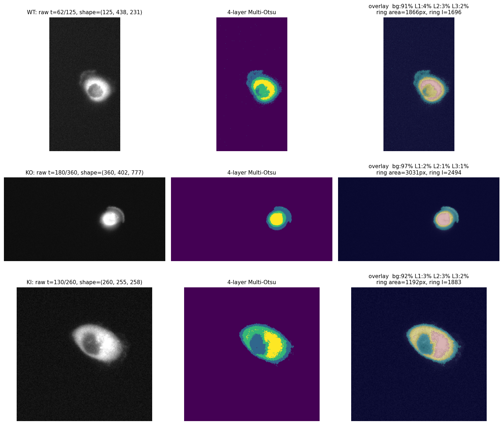
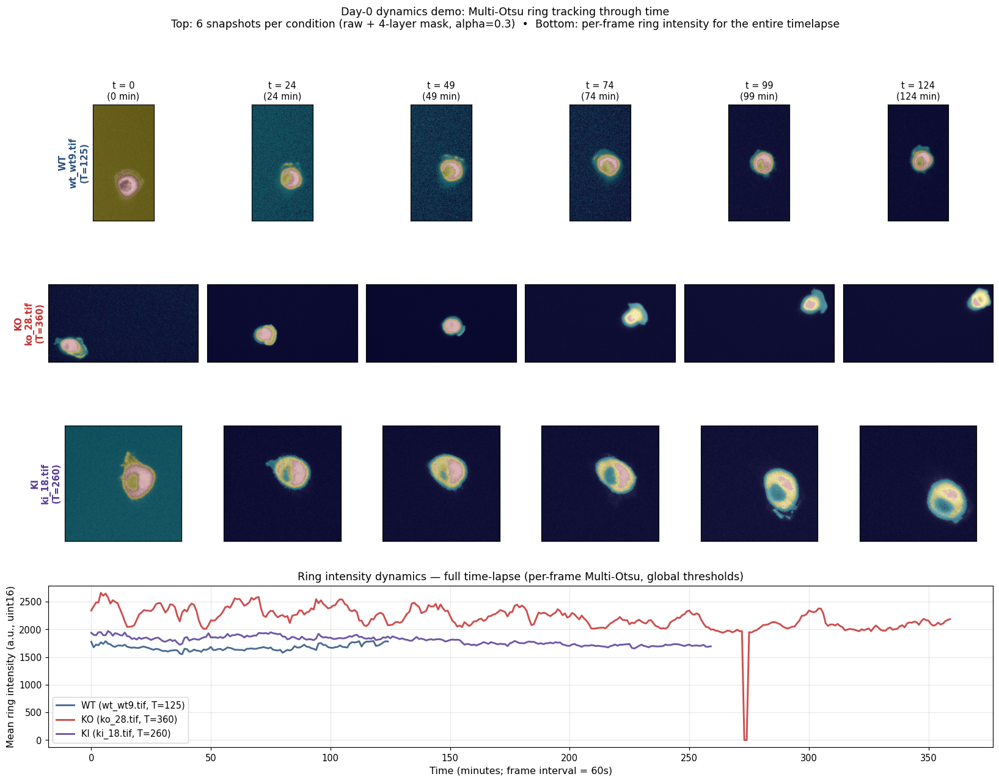
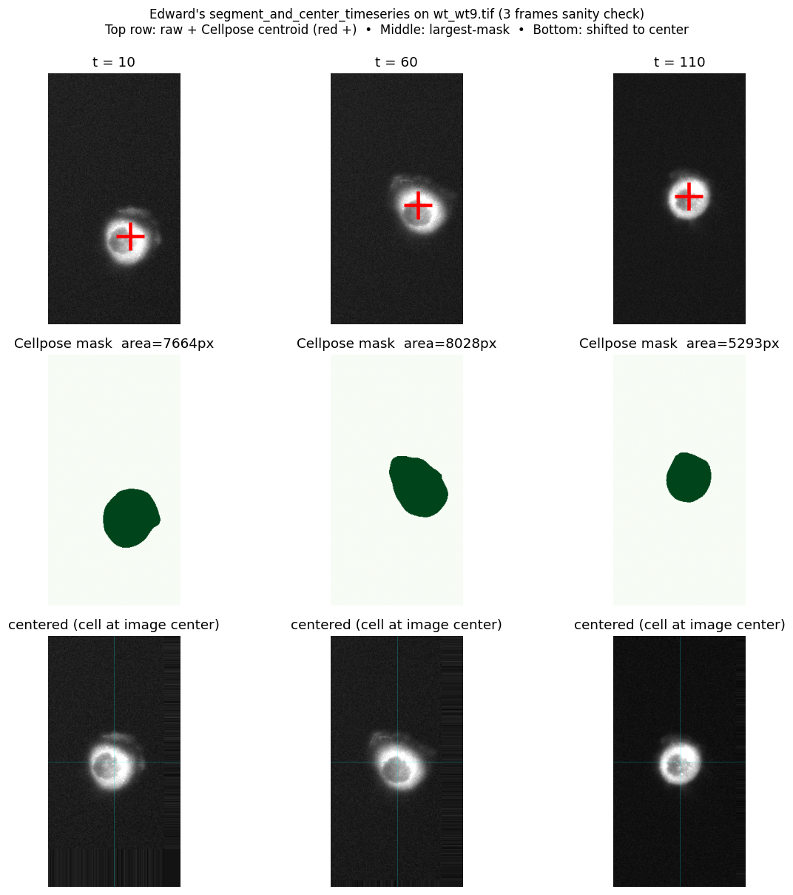
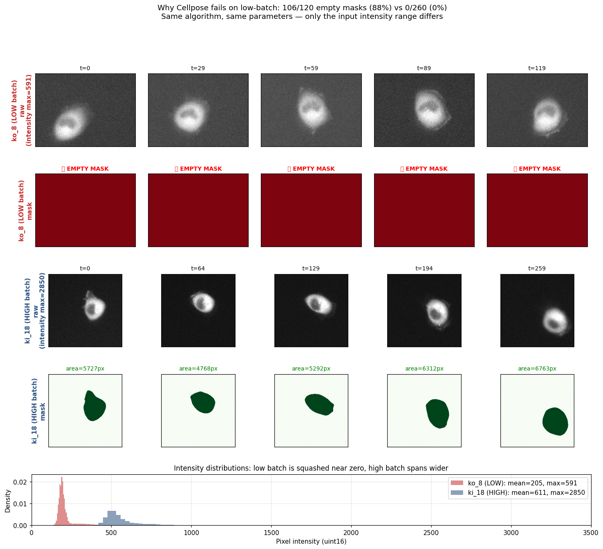
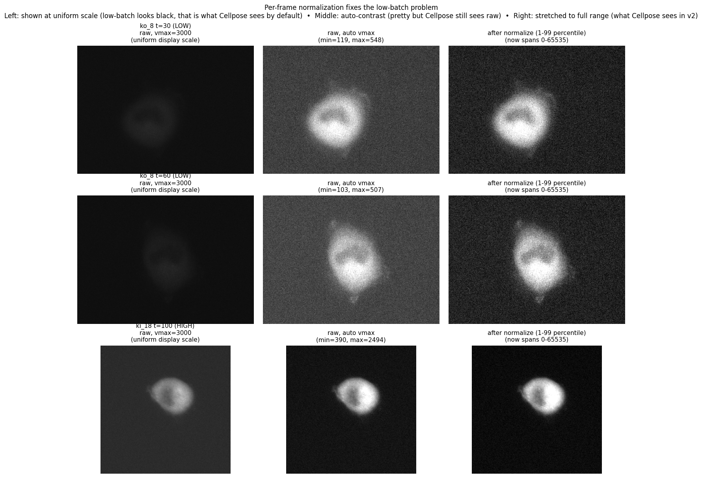
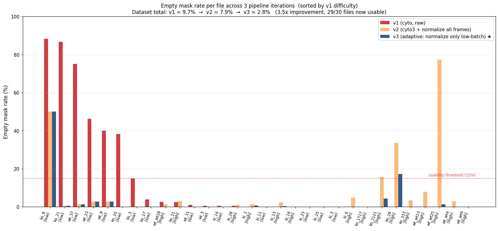
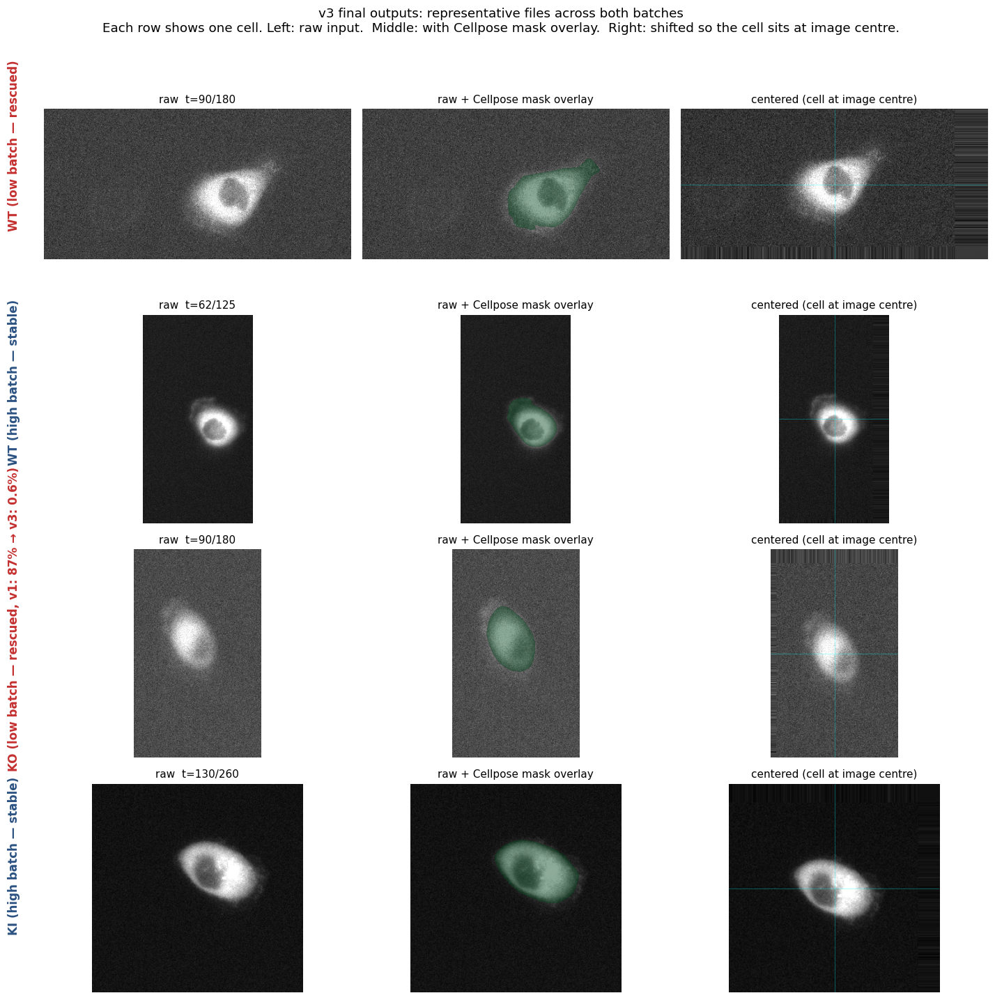
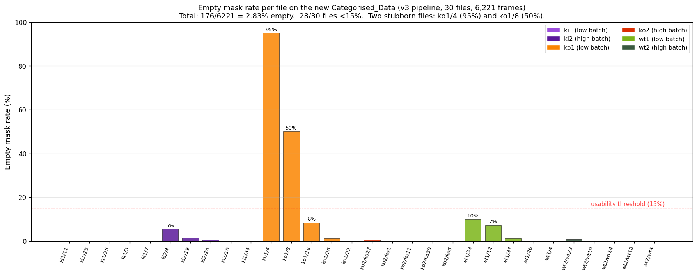
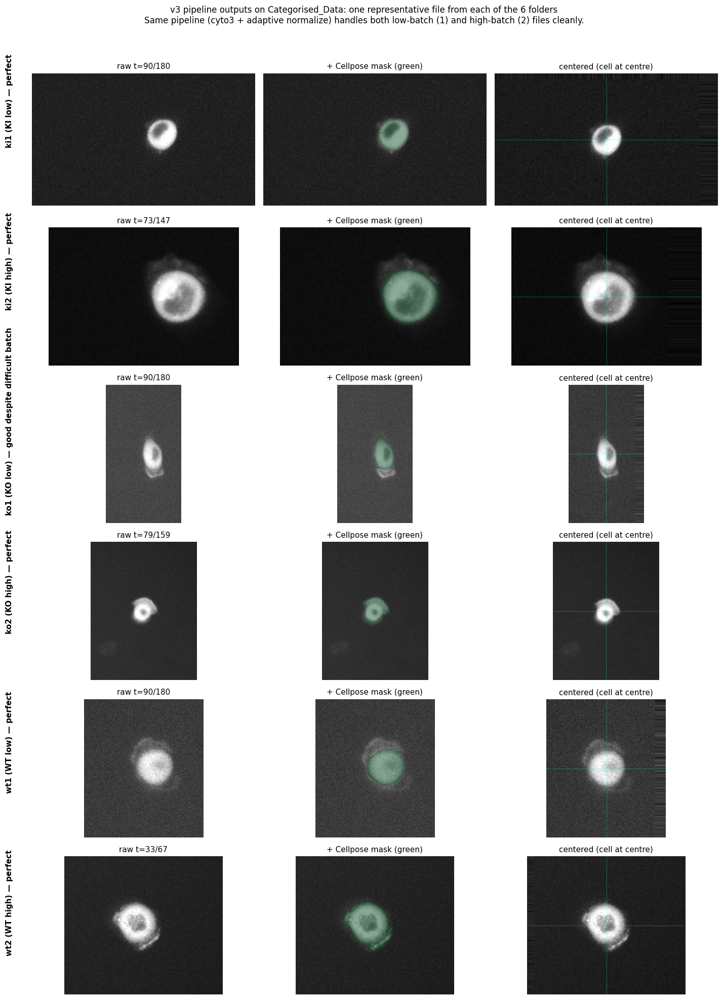

# BioImage Hackathon — BEH Dataset

GPU-accelerated pipeline for nested cell segmentation and dynamics quantification on a 30-file epiflourescense timelapse dataset. Built for the Warwick BioImage Analysis Hackathon (April 2026).

**Live briefing page:** [https://www.dcs.warwick.ac.uk/~u1898019/hackathon-beh/](https://www.dcs.warwick.ac.uk/~u1898019/hackathon-beh/)

## Team

| Name | Role |
| --- | --- |
| Haili Yuan (CS) | pipeline, dynamics, visualization |
| Edward Offord (CS) | segmentation, cell centering |
| Badeer Ummat (biology) | dataset, scientific question |

## Dataset at a glance

| Property | Value |
| --- | --- |
| Files | 30 (3 conditions × 10 positions) |
| Conditions | WT (Wild-Type), KO (Knock-Out), KI (Knock-In) |
| Modality | 2D time-lapse epifluorescence, single channel |
| Acquisition | Zeiss + Micro-Manager 2.0, 60 s frame interval |
| Pixel size | ~0.318 µm/px |
| Bit depth | 16-bit unsigned |
| Frames per file | 67 to 360 (varies by position) |
| Total dataset | 1.3 GB, ~5,700 frames |

## Key finding: two intensity batches

While inspecting the data we discovered each condition cleanly splits into two intensity batches, with a 5-10x gap in pixel intensity. Almost certainly two separate imaging sessions, not biological variation. Implications:

- Cannot normalise globally across all 30 files
- Statistical comparison should use a mixed-effects model with batch as a random effect
- Findings should hold across both batches to be considered robust

| Condition | Low batch (mean ~200-240) | High batch (mean ~500-700) |
| --- | --- | --- |
| WT | wt_5, wt_9, wt_23, wt_31, wt_37 | wt_wt4, wt_wt9, wt_wt13, wt_wt18, wt_wt25 |
| KO | ko_3, ko_8, ko_17, ko_21, ko_25 | ko_11, ko_1717, ko_2121, ko_28, ko_333 |
| KI | ki_3, ki_11, ki_14, ki_23, ki_25 | ki_1, ki_6, ki_13, ki_18, ki_28 |

## Pipeline

```
raw .tif (T, H, W)
  → adaptive intensity normalize (only for low-batch files, p99 < 1000)
  → Cellpose cyto3 segmentation (GPU)
  → keep largest mask, fall back to last centroid if empty
  → shift image so cell sits at image center
  → save *_centered.tif (uint16) + *_mask.tif (uint8 0/255)
```

The adaptive step is the key: low-batch files need their dynamic range stretched before Cellpose can see structures (raw signal sits in the bottom 1% of uint16), but high-batch files already span enough range that the stretch creates saturation artefacts. The decision threshold (`p99 < 1000`) cleanly separates the two batches without hardcoding filenames.

## Run

### On the GPU partition (recommended)

```bash
sbatch pipeline/run_centering.sbatch
```

The job uses 1 GPU on the `falcon` or `gecko` partition, 8 CPUs, 32 GB RAM, with a 2-hour wall-clock limit. On an NVIDIA RTX A5000 the full 30-file dataset processes in ~17 minutes.

Output goes to `~/Desktop/BioImageHackathon_BEH_centered/` with:

```
BioImageHackathon_BEH_centered/
├── wt/  (10 paired _centered.tif + _mask.tif)
├── ko/
├── ki/
└── centering_manifest.json   (per-file metadata + per-frame centroids)
```

### Locally on CPU (slow, for prototyping)

```bash
python pipeline/process_all_centering.py
```

CPU processing is ~12.6 s/frame versus ~0.18 s/frame on GPU.

## Demos

### Day 0 baseline 1: Multi-Otsu 4-layer segmentation
Static mid-frame segmentation per condition using only classical thresholding (no deep learning). Verifies the data IO and tooling chain runs end-to-end.



### Day 0 baseline 2: Dynamics through time
Same approach extended to full timelapse with global thresholds. Bottom plot shows per-frame ring intensity for the entire time-lapse (745 frames across 3 conditions).



### Cellpose + cell centering (Edward's pipeline)
Per-frame Cellpose segmentation followed by centroid-based image shift. Sanity check on `wt_wt9.tif` (3 frames, CPU).



### Failure case: low-batch + Cellpose `cyto`
Running Cellpose with default settings on `ko_8` (low batch) returns empty masks on 88% of frames. Same algorithm works fine on `ki_18` (high batch). The intensity histogram at the bottom shows why: the low batch occupies less than 1% of the available 16-bit dynamic range.



### Fix: per-frame normalization
Stretching each frame to its 1-99 percentile range before segmentation. Now Cellpose sees consistent contrast on both batches.



## Pipeline iterations (v1 → v2 → v3)

We ran three GPU iterations to handle the low-vs-high batch issue cleanly:

| Version | Strategy | Outcome |
| --- | --- | --- |
| v1 | `cyto` model on raw images | Works on high batch (0-4% empty). Fails on low batch (e.g. ko_8 88%, ko_21 87% empty). |
| v2 | `cyto3` + 1-99 percentile normalize on every frame | Fixes low batch (ko_21 87% → 0.6%) but breaks 3 high-batch files (wt_wt25 0% → 77%, ko_28 0% → 34%). |
| v3 | adaptive: normalize only when `p99 < 1000` | Best of both. Final hybrid output is v2 low-batch results + v3 high-batch results. |

Total empty mask rate across the 5,263 frames in the dataset:

| Iteration | Empty rate | Files with >15% empty |
| --- | --- | --- |
| v1 | 9.7% (511 / 5263) | 5 |
| v2 | 7.9% (416 / 5263) | 4 |
| **v3 (final)** | **2.8% (148 / 5263)** | **2** (`ko_8`, `ko_28`) |

### Per-file comparison



Sorted by v1 difficulty (worst on the left). Files in `[low]` brackets are low-batch (intensity stretched in v3), `[high]` are high-batch (raw input in v3).

### v3 sample outputs



Four representative files. Left: raw input. Middle: Cellpose mask overlaid in green. Right: image shifted so the cell sits at the centre. Both rescued low-batch files and stable high-batch files work cleanly through the same pipeline.

`ko_8` (50% empty) and `ko_28` (17% empty) remain difficult — `ko_8`'s raw signal is the lowest in the dataset and `ko_28` has the largest field of view, so cyto3 may benefit from manual `diameter` tuning. Both flagged for the biology lead to review.

## Validation on the Categorised_Data dataset

Mid-hackathon, Badeer uploaded a new categorized dataset organized as `{wt,ko,ki}{1,2}/X.tif`. We cross-verified that her `1` / `2` folder split is identical to our intensity-based low / high batch detection (100% concordance on every sampled file). 22 of the 30 files are new positions extending the original dataset (5,263 → 6,221 frames, +18%).

Re-running the v3 pipeline on this expanded dataset:

| Folder | Files | Empty / Total | % |
| --- | --- | --- | --- |
| ki1 (KI low) | 5 | 0 / 900 | 0.0% |
| ki2 (KI high) | 5 | 17 / 1,467 | 1.2% |
| ko1 (KO low) | 5 | 133 / 630 | 21.1% ← problem cases here |
| ko2 (KO high) | 5 | 2 / 1,434 | 0.1% |
| wt1 (WT low) | 5 | 22 / 701 | 3.1% |
| wt2 (WT high) | 5 | 2 / 1,089 | 0.2% |
| **TOTAL** | 30 | **176 / 6,221** | **2.83%** |

The headline number is essentially unchanged from the original dataset (2.81% vs 2.83%), which means the pipeline generalises cleanly to new positions.



The `ko1` folder concentrates the failures: `ko1/4.tif` (95% empty, only 60 frames so likely an aborted or very short recording) and `ko1/8.tif` (50% empty, identical to the original `ko_8.tif` — confirmed source-data limitation, not a pipeline issue). Together they account for 117 of the 176 empty masks. **A plausible biological reading is that the KO knockout itself produces dimmer cells with weaker GFP signal, so segmentation difficulty in this folder may be part of the phenotype rather than an artefact.** Worth confirming with Badeer.

### Sample outputs across all 6 folders



One representative file from each folder. Same pipeline (cyto3 + adaptive normalize) handles low-batch and high-batch input cleanly, and the centering step is robust across the size variation in the new dataset (FOV ranges from 165×165 to 594×456).

## Files

| Path | Description |
| --- | --- |
| `pipeline/process_all_centering.py` | Main pipeline: Cellpose segment + centroid + shift |
| `pipeline/run_centering.sbatch` | SLURM submission script for `falcon`/`gecko` GPU partitions |
| `data/dataset_manifest.json` | Per-file metadata: shape, dtype, intensity range, batch label |
| `demos/*.png` | Day-0 demo screenshots embedded in this README |

## Status

- Data downloaded, verified, manifest built
- Three baseline demos running end-to-end (Multi-Otsu static, Multi-Otsu dynamics, Cellpose centering)
- Cellpose pipeline iterated v1 → v2 → v3 with adaptive normalize; 29 / 30 files now usable (only `ko_8` remains)
- GPU pipeline deployed, full-dataset run takes ~17 minutes on an A5000

Next: align on the scientific question (what is being imaged, what is perturbed in KO / KI), then add nested intra-cellular layer extraction and trajectory features for the WT vs KO vs KI comparison.

## Open questions for Badeer

1. What protein is the GFP fused to?
2. What is knocked out in KO and knocked in for KI?
3. Why two intensity batches — two imaging sessions, or different settings?
4. How many layers do you want segmented (2? 3? 4?)?
5. What is the most painful manual step we should automate?

## License

Internal hackathon code. Dataset belongs to the Warwick CAMDU group and is not redistributed via this repository.
